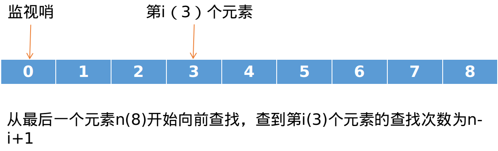

# 目录

- [查找](#查找)
- [静态查找表](#静态查找表)
- [二叉排序树]()
- [平衡二叉树]()

## 查找
**查找**就是在数据集合中寻找满足某种条件的数据对象。**查找表**是同一类型的数据元素（或者记录）组成的数据集合。**查找结果**有两种可能**查找成功**（找到满足条件的数据对象）和**查找不成功**（作为结果，报告一些信息，如失败标志、失败位置）。
<br>
<br>
**关键字**是数据元素中某个数据项的值，用以标识一个数据元素。**主关键字**可唯一地标识一个数据元素；**次关键字**用以标识若干记录的关键字。使用基于主关键字的查找，结果应是唯一的。
<br>
<br>
**衡量一个查找算法副的时间效率的标准是**：关键字的平均比较次数和平度读写磁盘次数（只适合于外部查找），这个标准也称为平均查找长度**ASL**（Average Search Length)。另外衡量一个查找算法还要考虑算法所需要的***存储量**和算法的**复杂性**等问题。

## 静态查找表
在静态查找表中，数据对象存放于数组中，利用元素的下标作为数据对象的存放地址。查找算法根据给定值x，在数组中进行查找。知道找到x在数组中的存放位置或确定在数组中找不到x为止。

### 1) 顺序表的查找(Sequential Search)
顺序查找又称**线性查找**
- 存储结构
```c++
typedef struct{
    ElemType *elem;
    int length;
    } SSTable;
```
- 算法
```c++
Search_Seq(SSTable ST, KeyType key)
{
    // 0号为监视哨
    int i;
    ST.elem[0].key = key;
    for(i = ST.length; ST.elem[i].key != key; --i);
    reurn i;
}
```
- 平均查找长度

设查找第$i$个元素的概率为$p_i$， 查找到第$$i$$个元素所需要的比较次数为$c_i$,则$c_i = n - i + 1, p_i = 1 / n$。



